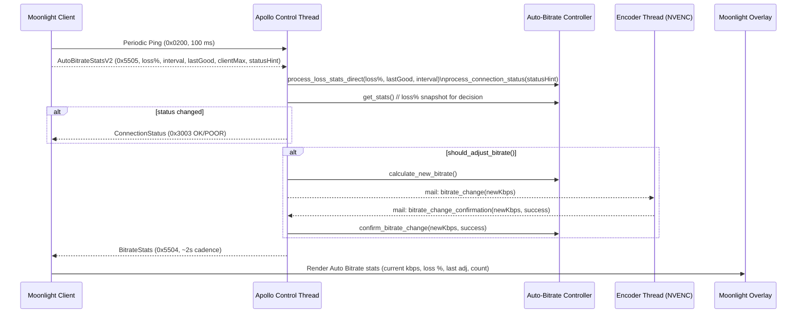
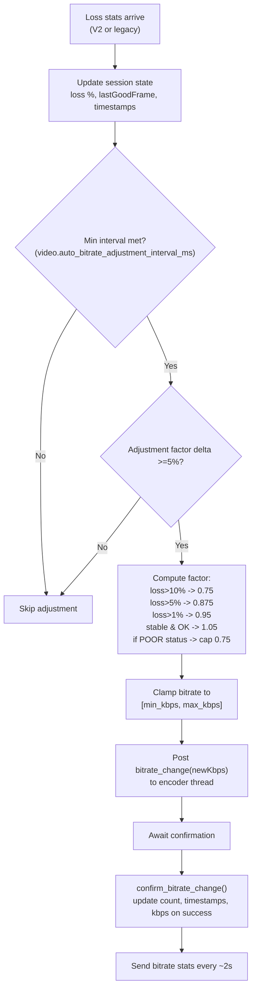

# Auto Bitrate (Sunshine/Apollo + Moonlight)

This document is both a quick-start guide for using automatic bitrate adjustment and a technical deep dive into how the feature is wired between Moonlight clients and the Apollo (Sunshine) host.

## How to Use
- **Client toggle:** In Moonlight settings, enable the “Auto adjust bitrate” checkbox. This sets `x-ml-video.autoBitrateEnabled=1` in RTSP setup.
- **Host requirement:** Apollo/Sunshine build that exposes `appversion` `7.1.431.-1` (Moonlight treats this as Sunshine) and supports the auto bitrate controller.
- **Protocol requirement:** Moonlight ≥ 7.1.415 (periodic ping path) for Sunshine targets. Older clients fall back to legacy loss stats.
- **Encoder support:** Dynamic bitrate reconfigure is implemented for NVENC only. Other encoders will reject changes (logged) and the controller will keep its last confirmed bitrate.
- **Tuning (sunshine.conf):**
  - `video.auto_bitrate_min_kbps` (default 500)
  - `video.auto_bitrate_max_kbps` (default 0 = use client max)
  - `video.auto_bitrate_adjustment_interval_ms` (default 3000)

## Operational Flow (Happy Path)
1) Client computes frame deltas and every 100 ms sends:
   - Periodic ping (`0x0200`, reliable, used for RTT)
   - Auto bitrate stats V2 (`0x5505`, unsequenced) with loss %, loss count, interval, last good frame, client max bitrate, and a connection-status hint.
2) Apollo control thread parses stats V2, updates the auto-bitrate controller, and runs a “tick”:
   - Derives connection status (OK/POOR) from loss %, sends status to client if changed (`0x3003`).
   - If adjustment criteria are met (loss thresholds + min interval + ≥5% change), it computes a new bitrate and posts a `bitrate_change` event to the encoder thread.
3) Encoder thread (NVENC) tries to reconfigure on the fly, then posts a confirmation event indicating success/failure.
4) Control thread records confirmed bitrate, updates counters/timestamps, and every ~2s sends bitrate stats to the client (`0x5504`).
5) Moonlight overlay shows host-reported stats: current bitrate, frame loss %, last adjustment time (since session start), and adjustment count.

### Control/Data Message Sequence

## Payloads (Sunshine targets)
- **AutoBitrateStatsV2 (client → host, type 0x5505, 32 bytes, little-endian):**
  - `loss_pct_milli` (u32), `loss_count` (u32), `interval_ms` (u32), `last_good_frame` (u64), `client_max_bitrate_kbps` (u32), `conn_status_hint` (u8: 0 OK, 1 POOR, 2 unknown), 7 bytes reserved.
- **ConnectionStatus (host → client, type 0x3003):** 1 byte (0 = OKAY, 1 = POOR).
- **BitrateStats (host → client, type 0x5504):**
  - `current_bitrate_kbps` (u32), `last_adjustment_time_ms` (u64, since session start), `adjustment_count` (u32), `loss_percentage` (float).
- **Fallback LossStats (client → host, type 0x0201, 32 bytes, little-endian):** legacy path used when `usePeriodicPing` is false; Apollo consumes it only if V2 telemetry has not been seen.

## Controller Logic at a Glance

## Observability
- Server logs (Apollo): look for `AutoBitrate: [StatsV2] ...`, `AutoBitrate: Adjusting bitrate to ...`, `AutoBitrate: Encoder accepted/rejected ...`, and connection-status logs.
- Client overlay (Moonlight): shows “Auto Bitrate” block when host stats are enabled; values are host-reported.
- Control channel: packet types `0x5505`, `0x3003`, `0x5504` on Sunshine; legacy `0x0201` if V2 is absent.

## Caveats and Edge Cases
- Stats freshness: Moonlight keeps the last received stats indefinitely; if the host stops sending, the overlay may show stale values.
- Encoder support: only NVENC dynamically reconfigures today; other encoders log rejection and the controller’s confirmed bitrate stays unchanged.
- Client→host connection status: Apollo can consume it (`0x3003`) but current Moonlight builds rely on the status hint inside StatsV2 instead of sending a dedicated message.
- Compatibility: Clients older than 7.1.415 (or non-Sunshine targets) use legacy loss stats; Apollo falls back to that path only if V2 telemetry never arrives.
